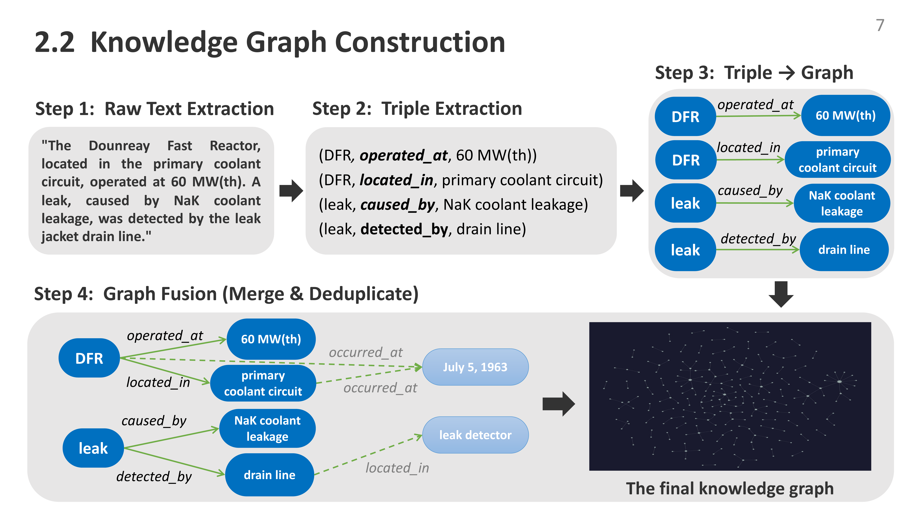
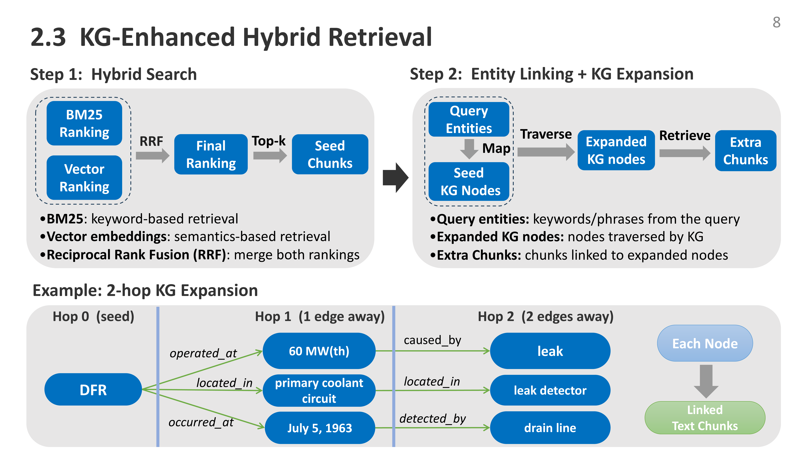
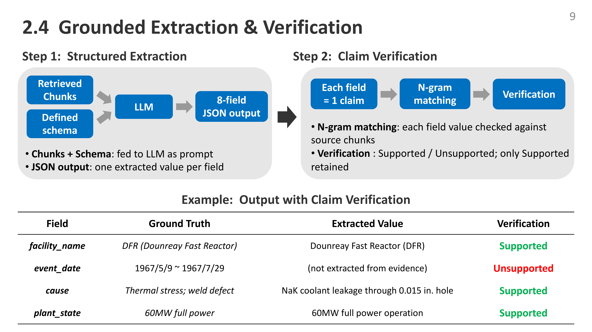

# KG-RAG4NuclearIE: Knowledge-Graph-Enhanced RAG for Structured Extraction of Nuclear Incident Reports

An NLP pipeline for extracting structured, hallucination-mitigated information from nuclear plant incident reports, combining **Knowledge Graphs** with **RAG**. Developed at **Demachi Laboratory, The University of Tokyo** with support from **JAEA**. Presented at **IPSJ 88th National Convention (2026)**.

> [Japanese README (main)](README.md)

## Background

Extracting reliable information from nuclear technical documents is difficult due to unstructured text, multilingual sources (EN/JP/FR), and evidence dispersed across reports. Naive RAG yields incomplete context and risks hallucination. We propose a **KG-RAG pipeline** that leverages knowledge graphs for **improved evidence completeness** and **controllable structured output**.

## Pipeline Overview

<p align="center">
  
</p>

## Method Details

### Knowledge Graph Construction

Triples `(subject, predicate, object)` are extracted from each chunk via LLM, then merged and deduplicated into a NetworkX MultiDiGraph.

<p align="center">
  
</p>

### KG-Enhanced Hybrid Retrieval

BM25 (keyword) + vector search (MiniLM-L6-v2) are fused via RRF, then multi-hop KG traversal (2 hops) recovers cross-document evidence.

<p align="center">
  
</p>

### Grounded Extraction & Verification

LLM extracts 8-field structured JSON. Each field is verified against evidence via N-gram matching; only **Supported** claims are retained.

<p align="center">
  
</p>

## 8-Field Extraction Schema

| # | Field | Description |
|---|---|---|
| 1 | `facility_name` | Facility / plant name |
| 2 | `event_date` | Date of incident |
| 3 | `event_location` | System / component where it occurred |
| 4 | `event_description` | Incident content, progression, damage scale, leak rate |
| 5 | `cause` | Root cause (weld defect, thermal stress, etc.) |
| 6 | `detection_method` | How the incident was discovered |
| 7 | `plant_status` | Plant operating state at time of incident |
| 8 | `response` | Post-incident actions, repair method, restart timeline |

## Experiment Configuration

| Item | Value |
|---|---|
| Corpus | 7 technical incident reports on fast reactors (~150 pages) |
| Chunks | 621 (512 tokens, overlap 50) |
| Knowledge Graph | 181 entities, 123 relations |
| Methods | RAG (baseline) vs KG-RAG (proposed) |
| LLMs | GPT-4-turbo (cloud) / Llama-3.1-8B (local) |

**Metrics**: Faithfulness (% Supported), Entity Precision (correct facility targeting), Evidence Size (#chunks)

## Results

| LLM | Method | Faithfulness | Entity Precision | #Retrieved |
|---|---|---|---|---|
| GPT-4-turbo | RAG | 36.4% | 50.0% | 5 |
| GPT-4-turbo | **KG-RAG** | **91.7%** | **100.0%** | 10 |
| Llama 3.1-8B | RAG | 100.0% | 50.0% | 5 |
| Llama 3.1-8B | **KG-RAG** | **100.0%** | **100.0%** | 10 |

### Key Findings

- **KG expansion doubles evidence coverage** — 2-hop traversal aggregates cross-document evidence (5 → 10 chunks), surfacing connections invisible to keyword/vector search alone
- **Entity-aware retrieval eliminates cross-entity confusion** — out-of-corpus queries (EBR-I) correctly return null (Vanilla RAG generates 14 unfaithful claims)
- **GPT-4 vs Llama — opposite hallucination patterns** — GPT-4 is creative but hallucinates (36.4% faith.); Llama is conservative but mis-targets entities (50% ent. prec.)
- **KG-RAG improves Entity Precision 50% → 100% for both models**

---

## Project Structure

```text
src/
  document_loader.py      -- Docling PDF parsing & text chunking
  knowledge_graph.py      -- LLM triple extraction & NetworkX graph
  retriever.py            -- BM25 + vector + RRF + KG expansion
  extractor.py            -- 8-field extraction & N-gram verification
  llm_client.py           -- Unified OpenAI / Llama wrapper
  pipeline.py             -- End-to-end pipeline orchestrator
  main.py                 -- CLI entry point

config/
  default.yaml            -- All pipeline hyperparameters
```

## Usage

```bash
pip install -e .
cp .env.example .env   # Set OPENAI_API_KEY
# Place PDFs in data/sample_docs/

kg-rag -q "What coolant leak incident occurred at DFR?"   # Single query
kg-rag                                                      # Interactive mode
kg-rag -q "DFR coolant leak details" -o results.json        # JSON export
```

```python
from src.pipeline import KGRAGPipeline, PipelineConfig

config = PipelineConfig(input_dir="data/sample_docs", llm_provider="openai", llm_model="gpt-4o")
pipeline = KGRAGPipeline(config)
pipeline.index()
results = pipeline.query("What incident occurred at DFR?")
```

## Tech Stack

| Component | Technology |
|---|---|
| Knowledge Graph | NetworkX (MultiDiGraph) |
| Sparse / Dense Retrieval | BM25 (rank-bm25) / Sentence-Transformers (MiniLM-L6-v2) |
| Rank Fusion | Reciprocal Rank Fusion (RRF) |
| LLM | OpenAI API (GPT-4-turbo) / Llama-3.1-8B (local) |
| Document Parsing | Docling |
| Claim Verification | Character N-gram overlap scoring |

## References

- P. Lewis et al., "Retrieval-Augmented Generation for Knowledge-Intensive NLP Tasks," *NeurIPS*, 2020.
- Z. Ji et al., "Survey of Hallucination in Natural Language Generation," *ACM Computing Surveys*, 2023.
- J.L. Phillips, "Full Power Operation of the Dounreay Fast Reactor," *ANS-100*, 1965.
- J.L. Phillips, "Operating Experience with the Dounreay Fast Reactor-2," *Nuclear Power*, 1962.
- R.R. Matthews et al., "Location and Repair of the DFR Leak," *Nuclear Engineering*, 1968.
